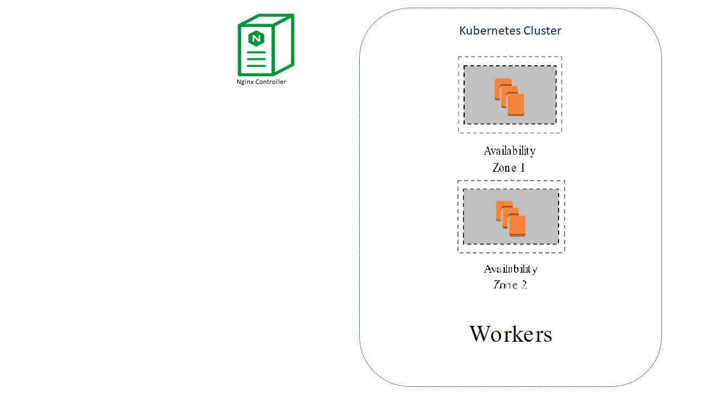

## Deploy NGINX infrastructure using Terraform

First we will start by using Terraform to deploy the initial infrastructure which includes the Amazon Elastic Kubernetes Service and the EC2 instance for the Nginx Controller.

Go to the "terraform" directory where we can find the terraform plan.

<pre>
cd terraform
</pre>

Run the following commands, terraform plan will show us what it is going to be deployed in AWS by Terraform:
<pre>
terraform init
terraform plan
</pre>
Now lets deploy the environment
<pre>
terraform apply --auto-approve
</pre>


It will take around 10 minutes for Terraform and AWS to finish the initial deployment.
While you wait, you can review the [Introduction section of the AWS EKS Workshop](https://eksworkshop.com/010_introduction/) to learn about Kubernetes and Amazon EKS basics.  

### Managed control plane
Amazon EKS provides a scalable and highly-available control plane that runs across multiple AWS availability zones. The Amazon EKS service automatically manages the availability and scalability of the Kubernetes API servers and the etcd persistence layer for each cluster. Amazon EKS runs the Kubernetes control plane across three Availability Zones in order to ensure high availability, and it automatically detects and replaces unhealthy masters.

### Managed worker nodes
Amazon EKS lets you create, update, or terminate worker nodes for your cluster with a single command. Managed node groups run nodes using the latest EKS-optimized AMIs in your AWS account while updates and terminations gracefully drain nodes to ensure your applications stay available.

Once Terraform is done, we need to verify the deployment is working as expected and we are able to control the Kubernetes environment.

We need to save the remote access config for the Kubernetes cluster locally:  
<pre>
Command:
mkdir ~/.kube/ 
terraform output > ~/.kube/config
</pre>

Let do a quick check and see that our cluster is up an running.  
Below we should see our two K8s worker nodes:
<pre>
Command:
kubectl get nodes

Output:   
NAME                                          STATUS   ROLES    AGE   VERSION  
ip-10-0-2-32.eu-central-1.compute.internal    Ready     none    84s   v1.15.10-eks-bac369  
ip-10-0-3-217.eu-central-1.compute.internal   Ready     none    88s   v1.15.10-eks-bac369  
</pre>

And the `kube-system` pods (this is the namespace for objects created by the Kubernetes system):  
<pre>
Command:
kubectl get pods -n kube-system

Output:
NAME                       READY   STATUS    RESTARTS   AGE  
aws-node-9hrrm             1/1     Running   0          14m  
aws-node-gmfkm             1/1     Running   0          14m  
coredns-5b6dbb4b59-5r9kb   1/1     Running   0          17m  
coredns-5b6dbb4b59-k5z6k   1/1     Running   0          17m  
kube-proxy-7lv9h           1/1     Running   0          14m  
kube-proxy-wmmxw           1/1     Running   0          14m  
</pre>

At the moment we have our setup deployed as it can be seen in the bellow diagram.



Change the directory back to the original repo folder:
```
cd ..
```

Next we will move on to deploying the application.

#### [Next part](4unit.md)
