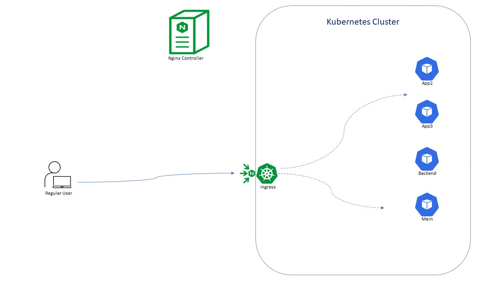

## Increase availability, security and application performance with Kubernetes Nginx Ingress - part 2

##### What is Open Tracing ?

So, what is OpenTracing? It’s a vendor-agnostic API to help developers easily instrument tracing into their code base. It’s open because no one company owns it. In fact, many tracing tooling companies are getting behind OpenTracing as a standardized way to instrument distributed tracing.

OpenTracing wants to form a common language around what a trace is and how to instrument them in our applications. In OpenTracing, a trace is a directed acyclic graph of Spans with References that may look like this :
<pre>
[Span A]  ←←←(the root span)
            |
     +------+------+
     |             |
 [Span B]      [Span C] ←←←(Span C is a `ChildOf` Span A)
     |             |
 [Span D]      +---+-------+
               |           |
           [Span E]    [Span F] >>> [Span G] >>> [Span H]
                                       ↑
                                       ↑
                                       ↑
                         (Span G `FollowsFrom` Span F)
</pre>
This allows us to model how our application calls out to other applications, internal functions, asynchronous jobs, etc. All of these can be modeled as Spans, as we’ll see below.

For example, if I have a consumer website where a customer places orders, I make a call to my payment system and my inventory system before asynchronously acknowledging the order. I can trace the entire order process through every system with an OpenTracing library and can render it like this:
<pre>
––|–––––––|–––––––|–––––––|–––––––|–––––––|–––––––|–––––––|–> time
 [Place Order···················································]
   [Receive Payment·····] [Fulfill Order··] [Email Order...]
</pre>

Open Tracing tracing is becoming more and more important because software systems are becoming more and more distributed and complex. We need ways to correlate them so that we can understand what is happening inside them. When we know what’s happening inside them, we can quickly hunt down defects and other incidents. Good distributed tracing tooling can save you hours or days of frustration.

##### MTLS with the Nginx Controller

Enabling MTLS on our Nginx Ingress Controller is quite simple, we are going to add two lines to the existing config.
1. Please update the `nginx-ingress-update.yaml` file with the following config:  

> ssl_client_certificate /etc/ssl/mycerts/ca.pem;  
> ssl_verify_client on;

This will enable MTLS while using the pre uploaded ca.pem certificate.

Update Ingress by applying the new configuration, which should now look like this:
<pre>
apiVersion: extensions/v1beta1
kind: Ingress
metadata:
  name: arcadia
  annotations:
    nginx.com/health-checks: "true"    	
    ingress.kubernetes.io/ssl-redirect: "true"
    nginx.com/sticky-cookie-services: "serviceName=arcadia-main srv_id expires=1h path=/"
    nginx.org/server-snippets: |
      proxy_ignore_headers X-Accel-Expires Expires Cache-Control;
      proxy_cache_valid any 30s;
      ssl_client_certificate /etc/ssl/mycerts/ca.pem;
      ssl_verify_client on;

    nginx.org/location-snippets: |      
      proxy_cache my_cache;
      add_header X-Cache-Status $upstream_cache_status;

spec:
  tls:
  - hosts:
    - MUST BE REPLACED WITH "EXTERNAL-IP" OF THE "nginx-ingress" SERVICE
    secretName: arcadia-tls
  rules:
  - host: MUST BE REPLACED WITH "EXTERNAL-IP" OF THE "nginx-ingress" SERVICE
    http:
      paths:
      - path: /
        backend:
          serviceName: arcadia-main
          servicePort: 80
      - path: /api/
        backend:
          serviceName: arcadia-app2
          servicePort: 80
      - path: /app3/
        backend:
          serviceName: arcadia-app3
          servicePort: 80
</pre>
  
:warning: Please note: you need to replace the `host` value with the EXTERNAL-IP of the `nginx-ingress` service.

2. Browse to the Arcadia site again, and you'll see that you can't access it since you don't have the client certificate.  
  
  
3. In order to verify this is actually working run the bellow command, it will use the client cert/key pair on the Cloud9 instance to authenticate:

> curl -v -k --key certs_for_mtls/01-alice.key --cert certs_for_mtls/01-alice.pem https://`<INGRESS-EXTERNAL-IP>`/

4. We are finished with this part of our experiance and achieved the bellow environment.  
Also before moving forward reapply the ingress configuration without the two lines we just added.
:warning: Please note: you need to replace the `host` value with the EXTERNAL-IP of the `nginx-ingress` service.

<pre>
apiVersion: extensions/v1beta1
kind: Ingress
metadata:
  name: arcadia
  annotations:
    nginx.com/health-checks: "true"    	
    ingress.kubernetes.io/ssl-redirect: "true"
    nginx.com/sticky-cookie-services: "serviceName=arcadia-main srv_id expires=1h path=/"
    nginx.org/server-snippets: |
      proxy_ignore_headers X-Accel-Expires Expires Cache-Control;
      proxy_cache_valid any 30s;      

    nginx.org/location-snippets: |      
      proxy_cache my_cache;
      add_header X-Cache-Status $upstream_cache_status;

spec:
  tls:
  - hosts:
    - MUST BE REPLACED WITH "EXTERNAL-IP" OF THE "nginx-ingress" SERVICE
    secretName: arcadia-tls
  rules:
  - host: MUST BE REPLACED WITH "EXTERNAL-IP" OF THE "nginx-ingress" SERVICE
    http:
      paths:
      - path: /
        backend:
          serviceName: arcadia-main
          servicePort: 80
      - path: /api/
        backend:
          serviceName: arcadia-app2
          servicePort: 80
      - path: /app3/
        backend:
          serviceName: arcadia-app3
          servicePort: 80
</pre>

#### [Next part](6controller.md)

